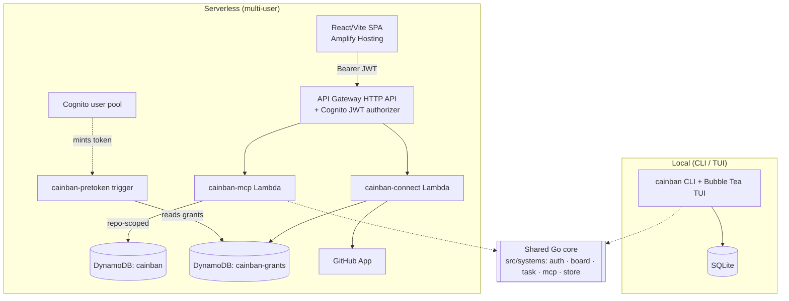
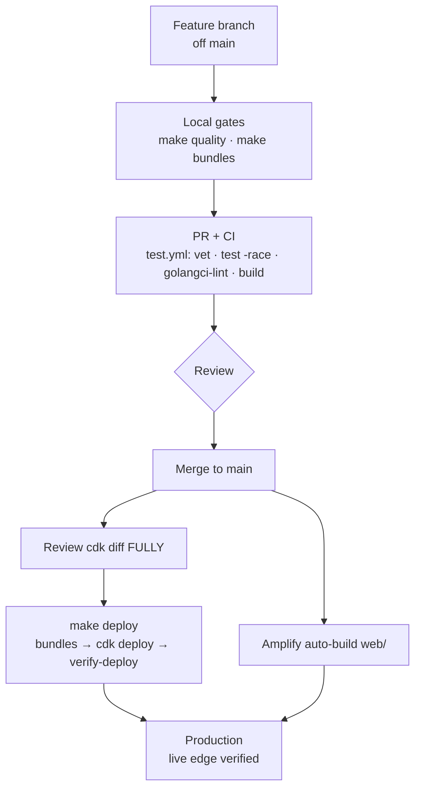
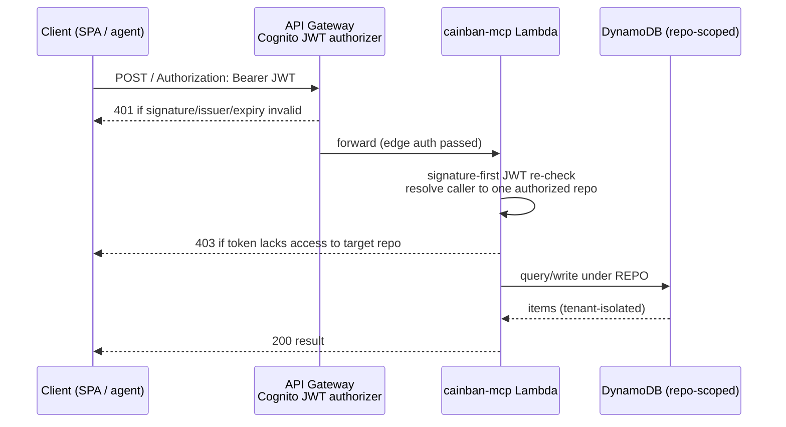

# cainban

cainban (c-AI-nban) is a kanban board you drive entirely from the command line. Use it for a todo list, your daily tasks, or a personal backlog.

It also gives AI coding agents a task backend over MCP, so an agent can break a project into small tasks and work through them one at a time.

## Overview

Everything cainban does works from the CLI, no GUI needed. There's a terminal UI (`cainban tui`) with viewport scrolling for large boards when you want one, and a built-in MCP server so AI tools can read and change the board.

It runs two ways from one codebase, chosen at runtime by `CAINBAN_BACKEND`: local SQLite for the CLI/TUI, and a serverless DynamoDB path for the AWS Lambda deployment. The serverless side is multi-user — a stateless MCP server on Lambda behind an API Gateway HTTP API and a Cognito JWT authorizer, with per-repo tenancy and a GitHub-App connect flow. See [Serverless deployment](#serverless-deployment) and [`infra/README.md`](infra/README.md).

## Getting started

### Install

The quickest path is a pre-built binary. Download the latest release for your platform from [GitHub Releases](https://github.com/hmain/cainban/releases):

- **Linux**: `cainban-linux-amd64` or `cainban-linux-arm64`
- **macOS**: `cainban-darwin-amd64` or `cainban-darwin-arm64` 
- **Windows**: `cainban-windows-amd64.exe`

```bash
# Example for Linux
wget https://github.com/hmain/cainban/releases/latest/download/cainban-linux-amd64
chmod +x cainban-linux-amd64
sudo mv cainban-linux-amd64 /usr/local/bin/cainban
```

### Build from source

```bash
git clone https://github.com/hmain/cainban.git
cd cainban

# Quickest: the install script
./install.sh

# Or build by hand:
go mod tidy
go build -o cainban cmd/cainban/main.go

# Initialize your board
./cainban init
```

### Basic usage

```bash
# Add tasks
./cainban add "Implement user authentication" "Add login and registration functionality"

# List all tasks (shows board-scoped IDs: #1, #2, #3, etc.)
./cainban list

# List tasks by status
./cainban list todo
./cainban list doing
./cainban list done

# Move tasks between columns (by board-scoped ID or fuzzy title match)
./cainban move 1 doing
./cainban move "user auth" doing

# Get task details (by board-scoped ID or fuzzy title match)
./cainban get 1
./cainban get "user auth"

# Update task (by board-scoped ID or fuzzy title match)
./cainban update 1 "Updated task title" "Updated description"
./cainban update "user auth" "Enhanced authentication system"

# Set task priority
./cainban priority 1 high
./cainban priority "user auth" critical

# Link tasks together (using board-scoped IDs)
./cainban link 1 2 blocks          # Task 1 blocks Task 2
./cainban link 3 4 depends_on      # Task 3 depends on Task 4
./cainban links 1                  # Show all links for Task 1
./cainban unlink 1 2 blocks        # Remove link between tasks

# Delete and restore tasks
./cainban delete 5                 # Soft delete (can be restored)
./cainban delete 6 --hard          # Permanent delete (cannot be restored)
./cainban restore 5                # Restore soft-deleted task

# Search tasks by title
./cainban search "auth"

# Launch interactive TUI
./cainban tui
```

### MCP server for AI tools

cainban has a built-in MCP server built on the official [Go MCP SDK](https://github.com/modelcontextprotocol/go-sdk), so it works with Kiro, Claude Desktop, and other MCP clients.

> **Using cainban as an AI agent's task backend?** See [`docs/agent-via-mcp.md`](docs/agent-via-mcp.md) for the agent-over-MCP guide: the auth/repo-scoping model, the exact MCP tools, and a worked agent loop against the serverless endpoint.

> **Serverless / multi-user.** Beyond the local CLI, cainban also runs as a
> multi-user serverless deployment: the stateless MCP server on AWS Lambda
> (arm64) behind an **API Gateway HTTP API + Cognito JWT authorizer**, with a
> DynamoDB backend and repo-scoped tenancy (`REPO#<owner>/<repo>#`). Clients send
> `Authorization: Bearer <Cognito JWT>` (no request signing). A GitHub App
> "connect" flow verifies a user's repo access before granting it. See
> [`infra/README.md`](infra/README.md) for the deployed stack and IAM surface,
> and [`docs/github-app-setup.md`](docs/github-app-setup.md) to connect a repo.

1. **For Kiro** (recommended):
   
Add to `~/.kiro/settings/mcp.json`:
```json
{
  "mcpServers": {
    "cainban": {
      "command": "cainban",
      "args": ["mcp"]
    }
  }
}
```

2. **For Claude Desktop**:

Add to your Claude Desktop configuration (update the `command` path to point to your cainban binary):
```json
{
  "mcpServers": {
    "cainban": {
      "command": "/path/to/your/cainban/cainban",
      "args": ["mcp"]
    }
  }
}
```

> **Project-specific access.** To share cainban with a team, commit an `mcp.json`
> with the same `mcpServers` block to your project root — teammates get cainban
> automatically when they clone the repo.

3. **Test the integration**:
   
```bash
# Try these commands:
"List all my tasks in cainban"
"Create a new task called 'Setup CI/CD pipeline'"
"Move task 1 to doing status"
```

#### Natural-language task management

Once it's configured, you manage the board by talking to the agent:

- **"List my tasks"** → Shows all tasks organized by status with priority indicators
- **"Create a task to implement user auth"** → Creates new task
- **"Move task 3 to doing"** → Updates task status
- **"Set task 5 to high priority"** → Updates task priority
- **"Show me details for task 5"** → Gets complete task information
- **"Add a task for code review with description 'Review PR #123'"** → Creates task with description
- **"List all my boards"** → Shows available kanban boards
- **"Switch to the project board"** → Changes active board

### Pointing an agent at your backlog

A pattern that works well: tell the agent to pick up the next task on the default board, and if a task has subtasks (`get_task_links`), start with those. Have it work on a branch, create new tasks for issues it finds, and break big tasks into small ones so it stays focused on one problem at a time.


## Key features

### Task priorities
Set priorities from the CLI or through an agent:

```bash
# Set priority levels: none, low, medium, high, critical (or 0-4)
./cainban priority 1 high
./cainban priority "user auth" critical

# Tasks automatically sort by priority in listings
# Critical tasks appear first, followed by high, medium, low, none
```

Tasks sort by priority in listings — critical first, then high, medium, low, none:

```
TODO:
  #8 [critical] Implement task dependencies
  #6 [high] Implement Bubble Tea TUI  
  #10 [high] Prepare for public release
  #9 [medium] Enhanced AI features
  #2 Create terminal UI (legacy)        # No priority = none
```

### Terminal UI
cainban has a terminal UI built on Bubble Tea:

```bash
# Launch the interactive interface
./cainban tui
```

It uses viewport scrolling, so it stays responsive on large boards (tested past 635 tasks). Navigate with `j`/`k` or the arrow keys, `Page Up`/`Page Down`, and `Home`/`End`; a `[X/Y]` indicator shows your scroll position. Columns resize with the terminal. Press `q` to quit, `?` for help.

**Navigation Example:**
```
┌─ cainban ─────────────────────────────────────────────────────┐
│ TODO [1/3]:                                                    │
│   #8 [critical] Implement task dependencies                    │
│   #6 [high] Enhanced TUI with viewport scrolling               │
│ DOING [2/3]:                                                   │
│   #10 [high] Prepare for public release                        │
│ DONE [3/3]:                                                    │
│   #9 [medium] Enhanced AI features                             │
└────────────────────────────── Press q to quit ────────────────┘
```

### Fuzzy task search
Reference tasks by partial title instead of memorizing IDs:

```bash
# Instead of: ./cainban move 10 doing
./cainban move "prep public" doing

# Instead of: ./cainban get 6  
./cainban get "bubble tea"

# Instead of: ./cainban priority 9 high
./cainban priority "enhanced ai" high

# Explicit search for exploration
./cainban search "terminal"
```

Matching is ranked: an exact title wins, then a substring, then a word prefix, with a bonus when several words match. A numeric argument is treated as an ID first and falls back to fuzzy search if no task has that ID. When more than one task matches, cainban shows the candidates instead of guessing.

## Architecture

cainban runs the same core two ways: a local CLI/TUI over SQLite, and a
multi-user serverless deployment over DynamoDB. The backend is chosen at runtime
by `CAINBAN_BACKEND`.



It's all Go — the CLI, the three Lambdas, and the CDK infra share one language. Storage is pluggable behind `CAINBAN_BACKEND`: SQLite locally (needs CGO), DynamoDB in the serverless path (pure Go). The domain logic lives in `src/systems/` (`auth`, `board`, `task`, `mcp`, `store`, `storage`, `dynamo`, `grants`, `github`, `connect`, `crypter`, `secrets`), the TUI uses [Bubble Tea](https://github.com/charmbracelet/bubbletea), and the serverless side is three arm64 `provided.al2023` Lambdas (`cainban-mcp`, `cainban-pretoken`, `cainban-connect`) deployed by an AWS CDK (Go) app in [`infra/`](infra/), plus a Cognito pool, two DynamoDB tables, and a React/Vite SPA in `web/` on Amplify.

Markdown rendering via [Glow](https://github.com/charmbracelet/glow) is still on the TODO list.

## AI integration

The MCP server exposes cainban's operations as tools and speaks JSON-RPC 2.0, so Kiro, Claude Desktop, and other MCP clients can read and change the board directly. The tools are `create_task`, `list_tasks`, `update_task_status`, `get_task`, `update_task_priority`, `update_task`, `link_tasks`, `unlink_tasks`, `get_task_links`, `delete_task`, `restore_task`, `list_boards`, `change_board`, and `list_activity` — the table below has an example call for each.

## MCP tools

| Tool | Description | Example Usage |
|------|-------------|---------------|
| `create_task` | Create new tasks | "Create a task to fix the login bug" |
| `list_tasks` | List all tasks or by status | "Show me all my todo tasks" |
| `update_task_status` | Move tasks between columns | "Move task 3 to doing" |
| `update_task_priority` | Set task priority | "Set task 5 to high priority" |
| `get_task` | Get detailed task information | "Show me details for task 5" |
| `update_task` | Update task title/description | "Update task 2 with new requirements" |
| `link_tasks` | Create links between tasks | "Link task 1 to block task 2" |
| `unlink_tasks` | Remove links between tasks | "Unlink task 1 from task 2" |
| `get_task_links` | Show all links for a task | "Show me all links for task 5" |
| `delete_task` | Delete task (soft delete by default) | "Delete task 8" |
| `restore_task` | Restore a soft-deleted task | "Restore task 8" |
| `list_boards` | List all available boards | "Show me all my boards" |
| `change_board` | Switch to a different board | "Switch to the project board" |
| `list_activity` | Recent task activity (who changed what), newest first | "Show recent activity on this board" |

## Development

### Prerequisites
- Go 1.26+ (matches `go.mod` and CI)
- SQLite3 (for the local backend; CGO required)
- For serverless work: AWS CDK v2 CLI, AWS credentials, and `curl` (see [`infra/README.md`](infra/README.md))

### Setup
```bash
git clone https://github.com/hmain/cainban.git
cd cainban
go mod tidy
go run cmd/cainban/main.go init
```

### Testing

```bash
# Run all tests
go test ./...

# Run with coverage
go test -cover ./...

# Run with race detection
go test -race ./...

# Run specific system tests
go test ./src/systems/task/...
go test ./src/tui/...

# Verbose output
go test -v ./src/tui/
```

Tests cover TUI navigation and resizing, task CRUD and priority, storage and migrations, and MCP tool registration. They run against in-memory databases, so they're fast and isolated.

### Code quality

Static checks: `go vet` and `golangci-lint` for Go, `sqlite3 -bail` to validate the SQLite schema, `markdownlint` for the docs. For runtime issues, `go test -race` catches data races and `go test -memprofile` catches leaks; the SQLite path runs with foreign keys and WAL mode on.

### Development to production workflow

cainban ships through a gated pipeline: nothing reaches the live serverless edge
without passing local gates, CI, a reviewed infra diff, and a post-deploy smoke
check. The flow below is the single source of truth — the Makefile targets and
CI jobs it names are what actually run.



#### 1. Branch

Feature branches off `main`, descriptive names (`feature/activity-feed`,
`fix/cors-preflight`, `docs/...`). Never commit to `main` directly; never force-push a protected branch.

#### 2. Local gates (before every push)

```bash
make quality          # golangci-lint + go test -race -cover ./...  (lint + test in one)
# or individually:
make lint             # golangci-lint
make test             # go test -race -cover ./...
go vet ./...          # also run in CI

# If you touched infra or any Lambda handler, confirm the bundles still build:
make bundles          # builds .build/lambda + .build/pretoken + .build/connect (arm64)

# If you touched the SPA:
cd web && npm ci && npm run build
```

Pre-commit hooks enforce the basics automatically — install once with `make setup-hooks`.

#### 3. Pull request + CI

Open a PR against `main`. The **`test.yml`** workflow runs three required jobs on
every push/PR: **test** (`go mod verify`, `go vet`, `go test -race` + coverage),
**lint** (`golangci-lint`), and **build** (`go build ./cmd/cainban`). All must be
green. CI runs Go **1.26** across every job.

> **Dependabot PRs** do not get a human-authored review by default, and a CLEAN
> status only means "no checks failed" — not "verified good". Check out the
> branch and run the full gate locally before merging, especially major bumps
> (a bad transitive bump can break `npm install`/`go build` without failing a
> status check).

#### 4. Review the infra diff (infra/Lambda changes only)

Code merging to `main` does **not** auto-deploy the serverless stack — deploys are
a deliberate, credentialed step. Before deploying, **always** review the CloudFormation diff and read it in full:

```bash
make bundles
cd infra && npx -y aws-cdk@2.1143.0 diff CainbanPhase2Stack
```

Look for: unexpected resource replacements/deletions, IAM widening, and
context-param drift (a flagless deploy can silently revert live values set
out-of-band — the real Entra/URL values live in the tracked `infra/cdk.json`
context so a plain deploy stays idempotent).

#### 5. Deploy (the one canonical command)

```bash
export AWS_PROFILE=aws-test-hamin AWS_REGION=eu-north-1
make deploy
```

`make deploy` is the only sanctioned path. It chains three steps so none can be
skipped:

1. `make bundles` — rebuild all three Lambda bundles from the current source
   (never trust a stale `.build/` after a branch switch).
2. `cdk deploy CainbanPhase2Stack` — apply the stack.
3. `make verify-deploy` — **auto-runs** as the final gate.

#### 6. Post-deploy verification (automatic, and re-runnable)

`make verify-deploy` smoke-checks the **live API edge** using endpoints read from
the deployed CloudFormation stack outputs (nothing hardcoded):

- the **CORS preflight** must succeed (unauthenticated `OPTIONS` → 2xx with
  `Access-Control-Allow-Origin`), on both `/` and a sub-path;
- the **data path must stay auth-gated** (unauthenticated request → 401), so a
  preflight fix can never silently open the data plane.

It exits non-zero on any failure (CI/pipeline-friendly). Run it standalone any
time against a deployed stack: `STACK=CainbanPhase2Stack make verify-deploy`.

This check exists because a CORS/authorizer regression is invisible to unit tests
and `cdk synth` — it only appears when a real browser hits the real gateway.
**When a frontend starts calling a new backend origin, the cross-origin preflight
is a first-class acceptance test, not an afterthought.**

#### 7. The web SPA

The `web/` SPA deploys separately via **Amplify Hosting**, which auto-builds on
push to `main` (outside GitHub Actions). After a merge that changes `web/`, confirm
the Amplify build succeeded on the merge commit and the live bundle carries the
change before calling it shipped.

#### Rollback

Infra/Lambda: redeploy the previous known-good commit with `make deploy` (the
stack is CloudFormation-managed; `cdk deploy` of an earlier source rolls forward
to that state). The DynamoDB tables are `RETAIN` + PITR, so data survives a stack
issue. The SPA rolls back by reverting the offending commit on `main` (Amplify
rebuilds).

### Git conventions

1. Feature branches from `main`; descriptive names.
2. Squash-merge to keep `main` history clean; delete the branch after merge.
3. No compatibility bridges — breaking changes are acceptable during development.
4. Verify a merge actually landed the tip commits on `main` before trusting a
   "merged" status.

### Project layout

```
cainban/
├── cmd/
│   ├── cainban/           # Main CLI + TUI application
│   ├── cainban-lambda/    # Serverless MCP handler (arm64 Lambda bootstrap)
│   ├── cainban-pretoken/  # Cognito pre-token-generation trigger
│   └── cainban-connect/   # GitHub-connect OAuth API Lambda
├── src/systems/           # Modular systems
│   ├── auth/             # Signature-first JWT validation + repo-scoped tenancy
│   ├── board/ task/      # Board + task domain logic
│   ├── mcp/              # MCP server + tool dispatch
│   ├── store/ storage/   # Storage abstraction
│   ├── dynamo/           # DynamoDB backend (serverless)
│   ├── grants/           # Per-user repo grants (grants table)
│   ├── github/ connect/  # GitHub App + connect flow
│   └── crypter/ secrets/ # KMS + Secrets Manager helpers
├── src/tui/              # Bubble Tea TUI
├── infra/               # AWS CDK (Go) app + verify-deploy.sh
├── web/                 # React/Vite SPA (Amplify-hosted)
├── docs/                # Design docs, RFCs, setup guides
└── tests/               # Integration tests
```

## Serverless deployment

Beyond the local CLI, cainban runs as a multi-user serverless deployment: a
stateless MCP server on **AWS Lambda (arm64)** behind an **API Gateway HTTP API +
Cognito JWT authorizer**, a **DynamoDB** backend with repo-scoped tenancy
(`REPO#<owner>/<repo>#`), and a **GitHub-App connect flow** that verifies a user's
repo access server-side before granting it. Clients send
`Authorization: Bearer <Cognito JWT>` (no request signing).

Authenticated request flow (401 if the token is missing/invalid, 403 if valid
but not granted the target repo):



Everything deploy-related — the full stack, IAM surface, env vars, the auth
design, the pre-token trigger, and the grants model — is documented in
[`infra/README.md`](infra/README.md). Deploy with the gated flow in
[Development → Production Workflow](#development-to-production-workflow)
(`make deploy`, which auto-runs `make verify-deploy`).

Related guides:
- [`docs/agent-via-mcp.md`](docs/agent-via-mcp.md) — using cainban as an AI agent's task backend over MCP
- [`docs/github-app-setup.md`](docs/github-app-setup.md) — register the GitHub App and connect a repo
- [`docs/mcp-oauth-setup.md`](docs/mcp-oauth-setup.md) — MCP OAuth client setup

## Troubleshooting

If the MCP server won't load, increase the launch timeout in your client's MCP settings (in Kiro, raise `timeout` on the server entry in `~/.kiro/settings/mcp.json`). If the tools don't show up, check the binary path in your MCP config. If you hit database errors, run `./cainban init` to create the database.

A few commands that help when something's off:

```bash
# Test MCP server manually
echo '{"jsonrpc":"2.0","id":1,"method":"initialize"}' | ./cainban mcp

# Check if binary is executable
chmod +x ./cainban

# Verify database location
ls -la ~/.cainban/cainban.db
```

## Status

The local CLI/TUI is stable: board-scoped task IDs, fuzzy search, task links, soft and hard delete, and the terminal UI.

The serverless multi-user side is live too — a stateless MCP server on Lambda behind the Cognito JWT authorizer, DynamoDB with per-repo tenancy, an atomic per-board id counter, an optimistic-concurrency `version` guard, an append-only activity feed (`list_activity`), and the GitHub-App connect flow with its React/Vite SPA. The `make deploy` → `make verify-deploy` pipeline guards the live edge.

The [`docs/`](docs/) folder has the MCP, agent, and GitHub-App setup guides.

## Contributing

Branch off `main`, make your change behind the code-quality checks above, add tests for anything new, and open a PR. The full gate and deploy flow is in [Development → Production Workflow](#development-to-production-workflow).

## License

MIT — see the LICENSE file.


